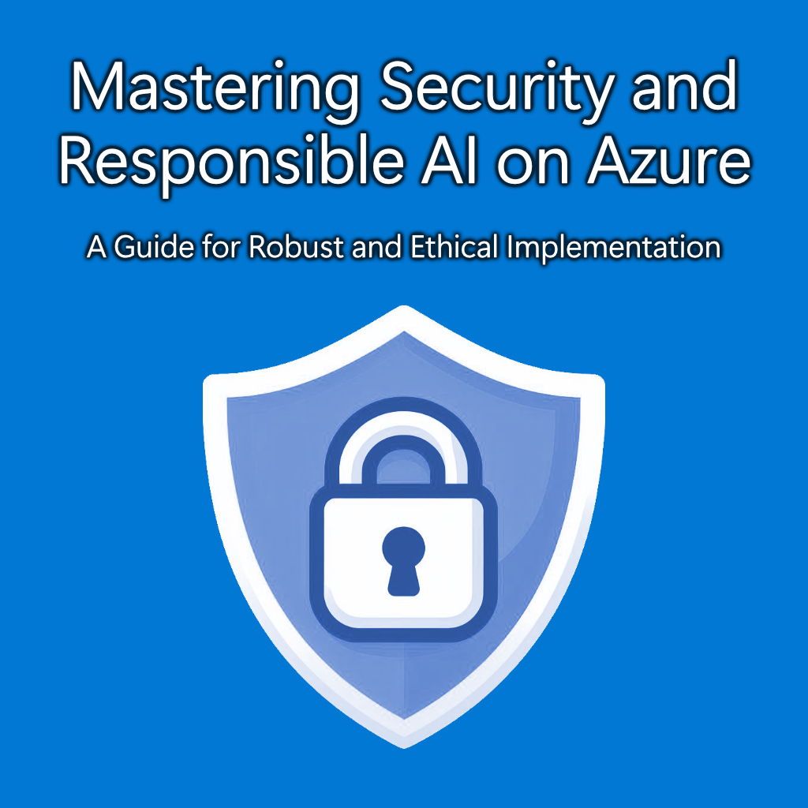

# Mastering Security and Responsible AI on Azure: A Guide for Robust and Ethical Implementation

This guide is a centralized resource for technical professionals who are looking to establish a strategy for implementing security and responsible AI practices on Azure. It addresses the challenges of creating trusted AI systems and provides guidance on how to design, develop, deploy, and use AI systems in a responsible manner. It is tailored to both a technical and business audience, offering considerations for establishing best practices. By consolidating the latest Azure security and responsible AI guidance and tools, we aim to make the journey to trusted AI more accessible and achievable for a wide range of organizations.

## Table of Contents

- [Chapter 1: Understanding Security and Responsible AI](./chapters/chapter_01_understanding_security_and_responsible_ai.md)
- [Chapter 2: Designing Secure, Responsible AI Solutions](./chapters/chapter_02_designing_secure_responsible_ai_solutions.md)
- [Chapter 3: Identifying and Assessing AI Risks](./chapters/chapter_03_identifying_and_assessing_ai_risks.md)
- [Chapter 4: Implementing Security Measures](./chapters/chapter_04_implementing_security_measures.md)
- [Chapter 5: Monitoring and Auditing AI Solutions](./chapters/chapter_05_monitoring_and_auditing_ai_solutions.md)
- [Chapter 6: Continuous Improvement in Security and Responsible AI](./chapters/chapter_06_continuous_improvement_in_security_and_responsible_ai.md)

## Contributors

The content and resources in this guide have been curated by the following original contributors.

Simran Kaur | Customer Engineer - Microsoft
Shep Sheppard | Senior Customer Engineer - Microsoft
James Croft | Customer Engineer - Microsoft
